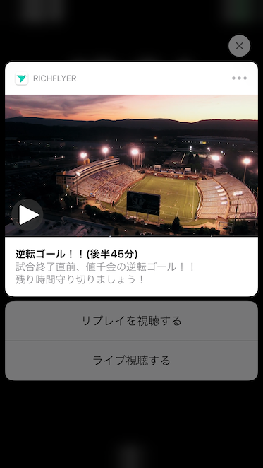

# RichFlyer SDK for React Native

## 概要
RichFlyerサービスを利用するために、React Nativeアプリに組み込むためのSDKです。

詳しい説明は、[SDKご利用ガイド](https://richflyer.net/sdk/manual/react-native/)をご覧ください。

## RichFlyerとは
RichFlyerは、モバイルプッシュ通知、ウェブプッシュ通知、TwitterなどのSNSへ同時にメッセージを配信できます。

プッシュ通知には、静止画、動画、GIFアニメーションを添付できます。
ウェブ管理画面では、マルチメディアの管理もできるため簡単にリッチなメッセージを配信できます。

機能の詳細や通知画面のサンプル動画をご覧いただきたい場合は、[公式サイト](https://richflyer.net/)をご覧ください。

詳しい手順については[SDKご利用ガイド](https://richflyer.net/sdk/manual/react-native/)をご参照ください。
